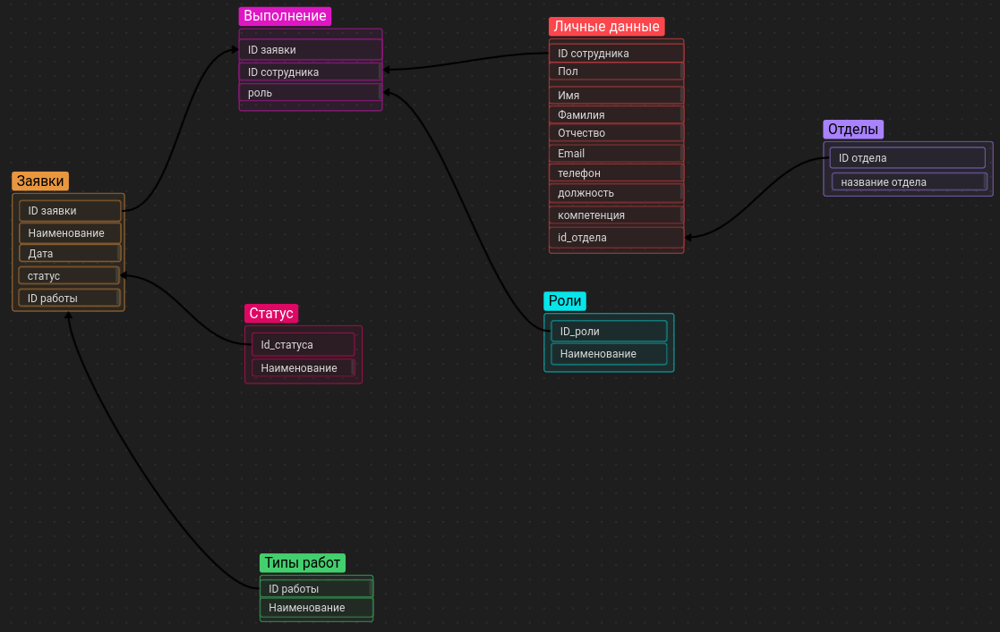

# Курсовая работа по базам данных
****
WORK IN PROGRESS
****
Последние изменения(теперь актуальные правки пишутся здесь, так как читать их в описании коммита неудобно):

1) Таблица отделы упразднена до двух атрибутов (Id отдела, Название отдела) в связи с ее нежизнеспособностью
2) Атрибуты должность и компетенция переммещены в Личные_данные(см пункт 1)
3) В README добавлена актуальная схема БД
4) Заполнены данными все таблицы, кроме заявок(итоговая таблица) и выполнения(промежуточная, которая решает проблему много-много)
5) Количество лишних данных снижено до 5 записе по просьбе преподавателя(5 записей на справочники, 15 на процесс)

****
Актуальная схема:

## Установка
Данные для подключения можно узнать из docker-compose файла

Для развертывания необхходимо:
1) git clone <ссылка на репозиторий>
2) cd ./DB_course_work
3) docker-compose build
4) docker-compose up

## Планы на будущее и сделанное на данный момент
- [x] расписаны все таблицы(возможны изменения)
- [x] контейнеризация для удобного деплоя базы 
- [x] заполнение данными
  - [x] как заполнить
  - [x] Использование [Faker](https://github.com/joke2k/faker) ?
- [ ] заполнение данными остальных таблиц (по аналогии с личными данными)
- [ ] возможно ли форматирование номеров faker под единый формат(опционально)
- [ ] словарь для faker, чтобы професси были не такими клоунскими и совпадали по смыслу с отделами(опционально)
- [ ] написание запросов
- [ ] реализация развертвыния через sh скрипт(возможность выбирать генерировать новые данные или нет, опционально)

